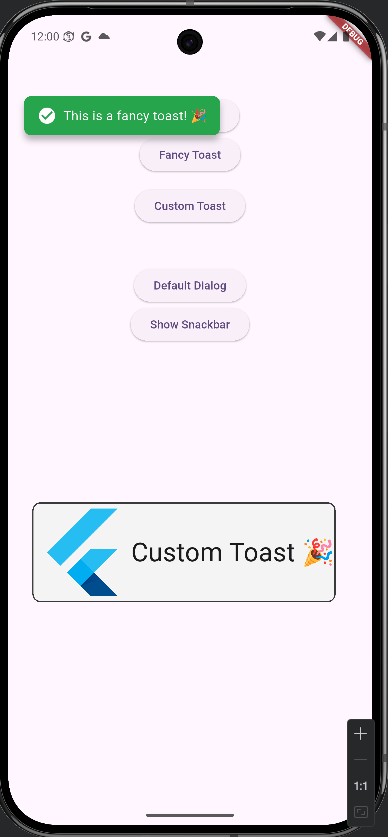

# default_utility

A Flutter package providing predefined and customizable Snackbar (toast message) and stateful dialog widgets without needing context.

## Features
Simple toast messages with customizable positions, types, icons, duration, and entry/exit animations
On-line style toast notifications without requiring BuildContext
Extensions for consistent spacing such as 10.h for height gap and 10.w for width gap
Stateful custom dialogs with confirmation buttons and callbacks, usable without BuildContext
Easy page navigation (pop/back) without needing BuildContext
Easy to integrate with minimal boilerplate

## Usage
To use `default_utility`, you must supply the global `navigatorKey` in your app’s `MaterialApp`. This allows showing toasts and dialogs anywhere, without context.

## Screenshots

